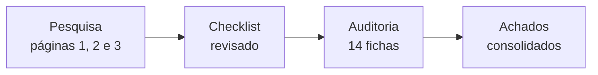

# Guia do Antonio

Este guia é o seu ponto de partida. Leia até o fim antes de começar — são 10 minutos.

---

## 1. O que estamos fazendo

Os formulários dos serviços digitais do Estado vão ser refeitos numa ferramenta nova (o **X-Forms**).
Antes de refazer, precisamos responder: **como um bom formulário deve ser?**

Seu trabalho tem duas partes:

1. **Pesquisar** o que já se sabe sobre bons formulários (páginas 1, 2 e 3 deste site).
2. **Auditar** 14 formulários que existem hoje, comparando com o que você pesquisou.

Sempre com uma pergunta na cabeça: **isso deixa o formulário mais fácil de preencher?**

---

## 2. Suas três perguntas de pesquisa

Cada página abaixo é um arquivo que **você preenche**. O arquivo já está criado, com as perguntas
dentro. Você abre, responde e apaga a pergunta.

### Página 1 — [Diagramação](01-diagramacao.md)

*Como dispor os campos na tela para a pessoa preencher rápido e sem errar?*

Responda: uma pergunta por tela ou tudo de uma vez? Quando agrupar campos? Que ordem seguir?
Uma coluna ou duas? Onde fica o botão de enviar? Marca-se o campo obrigatório ou o opcional?

**Onde procurar:** GOV.UK Design System (procure os padrões de formulário e o conceito
*one thing per page*), Design System do gov.br, Nielsen Norman Group (form design),
Baymard Institute.

### Página 2 — [Aprendizados](02-aprendizados.md)

*O que faz a pessoa desistir no meio do preenchimento?*

Responda: que erros se repetem em formulário de governo? Como escrever uma mensagem de erro que
ajuda em vez de culpar? Que dado o governo já tem e não deveria pedir de novo?

**Onde procurar:** WCAG 2.2 (critérios 3.3.x — rótulos, identificação e sugestão de erro),
Lei 14.129/2021 (o governo não pode exigir dado que já possui), LGPD art. 6º III (minimização de
dados), Lei 15.263/2025 e Decreto Estadual 16.744/2026 (linguagem simples).

### Página 3 — [Nomenclatura](03-nomenclatura.md)

*Como nomear os campos?*

Aqui existe uma distinção que é o centro de tudo:

| | O que é | Exemplo |
|---|---|---|
| **Rótulo** | O texto que o cidadão lê na tela | `CPF` |
| **Nome técnico** | A chave que vai no JSON enviado ao Integrador | `cpf` |

Um formulário pode ter o rótulo perfeito e o nome técnico uma bagunça — e aí o dado não conversa
entre serviços. Se em um serviço o campo se chama `cpf`, em outro `CPF_solicitante` e em outro
`documento`, ninguém consegue cruzar nada depois.

Responda: qual convenção usar no nome técnico? Como garantir que o mesmo dado tenha sempre o mesmo
nome em todo serviço? Como nomear anexo e campo que se repete?

E monte o **dicionário de campos canônicos** — a tabela com os campos que aparecem em todo
formulário (CPF, CNPJ, nome, e-mail, telefone, CEP, endereço, data de nascimento…), dizendo o nome
técnico, o rótulo recomendado, o tipo, a máscara e a validação de cada um.

---

## 3. Como escrever

Cinco regras. São curtas de propósito.

### 3.1. Marque toda afirmação

Use um dos três marcadores no começo da frase:

- `[FATO]` — alguém publicou isso; você tem o link.
- `[INTERPRETAÇÃO]` — é a sua conclusão a partir dos fatos.
- `[RECOMENDAÇÃO]` — é o que você propõe para o X-Forms.

**Exemplo:**

> `[FATO]` O GOV.UK recomenda uma pergunta por página em formulários de serviço público.
> `[INTERPRETAÇÃO]` Nos serviços do Estado, isso tende a ajudar mais nos fluxos longos, com anexo.
> `[RECOMENDAÇÃO]` Adotar uma pergunta por tela quando o formulário passar de 10 campos.

### 3.2. Todo `[FATO]` tem fonte

Registre em [fontes.md](fontes.md): título, link e data em que você acessou. Sem fonte, não é
`[FATO]` — é `[INTERPRETAÇÃO]`.

### 3.3. Nunca copie mais que 25 palavras seguidas

Leia, entenda e escreva com as suas palavras. Copiar bloco inteiro de texto de outro site não é
pesquisa e tem problema de direito autoral.

### 3.4. Não achou? Escreva `**Não identificado**`

É uma resposta legítima e útil. Inventar não é.

### 3.5. Escreva simples

Frase curta. Português do Brasil. Sem jargão. Se precisar usar um termo técnico, explique na
primeira vez que aparecer.

❌ "Implementar mecanismos de validação client-side visando mitigar a incidência de inputs inválidos."
✅ "Validar o campo na hora em que a pessoa digita, para ela corrigir antes de enviar."

---

## 4. Como auditar os 14 formulários

Para cada serviço da [lista](05-auditoria.md):

1. Abra o serviço no Portal e vá até o formulário.
2. Copie o arquivo `docs/fichas/_template.md` para `docs/fichas/01-nome-do-servico.md`.
3. Preencha a ficha enquanto navega — não confie na memória depois.
4. Tire print de cada tela e salve em `docs/assets/img/fichas/`.
5. Aplique o [checklist](04-checklist.md), marcando sim / não / não se aplica.
6. Atualize a linha desse serviço na tabela de [05-auditoria.md](05-auditoria.md).

!!! warning "Não envie o formulário de verdade"
    Você está olhando, não solicitando. Preencha até onde der para ver os campos e as validações,
    mas **não conclua o envio** — isso criaria uma solicitação real no órgão. Se o formulário só
    mostrar a próxima etapa depois de enviar, registre isso na ficha como limite da análise e
    fale com o Fabio.

Se algum formulário exigir login que você não tem, ou pedir dado que você não possui, **pare e
avise**. Não force.

---

## 5. Em que ordem trabalhar



**Pesquisa primeiro, auditoria depois.** Motivo: o checklist é a régua da auditoria. Sem entender o
que é um bom formulário, você não reconhece um ruim — só anota o que achou estranho.

Quando terminar a pesquisa, revise o [checklist](04-checklist.md) com o Fabio: o que você
descobriu pode acrescentar ou tirar itens dele.

---

## 6. Como consolidar as recomendações

Quando terminar de mapear os 14 formulários, abra
[`docs/andamento/recomendacoes.md`](andamento/recomendacoes.md) e classifique
cada achado em **uma** das 3 seções:

1. **Achados que se repetem** — o mesmo problema aparece em 2 ou mais
   formulários? Vira linha da tabela. Preencha a coluna *Em quantos* — sem
   número, não é padrão.
2. **O que já está bom** — funciona hoje e precisa **sobreviver** ao X-Forms?
   Lista curta, uma linha por prática.
3. **O que precisa mudar** — mudança estrutural que atravessa vários
   formulários? Ordem = impacto na experiência.

**Regra:** achado que só apareceu em 1 formulário **não** fica em
`recomendacoes.md`. Volta para a ficha dele em
`docs/andamento/mapeamento/NN-nome.md`.

Depois de fechar `recomendacoes.md`, avise o Fabio — ele espelha o resumo em
`docs/05-auditoria.md` para levar à SGD.

---

## 7. Como rodar o site na sua máquina

```bash
pip install -r requirements.txt
python -m mkdocs serve -a 127.0.0.1:8000
```

Abra `http://127.0.0.1:8000`. Ele atualiza sozinho a cada arquivo que você salvar.

Antes de entregar, rode:

```bash
python -m mkdocs build --strict
```

Se aparecer erro, tem link quebrado ou página fora da navegação. Corrija antes de avisar que acabou.

---

## 8. Dúvidas

Anote a dúvida e siga para a próxima parte — não fique travado. Traga a lista para o Fabio na
próxima conversa.
